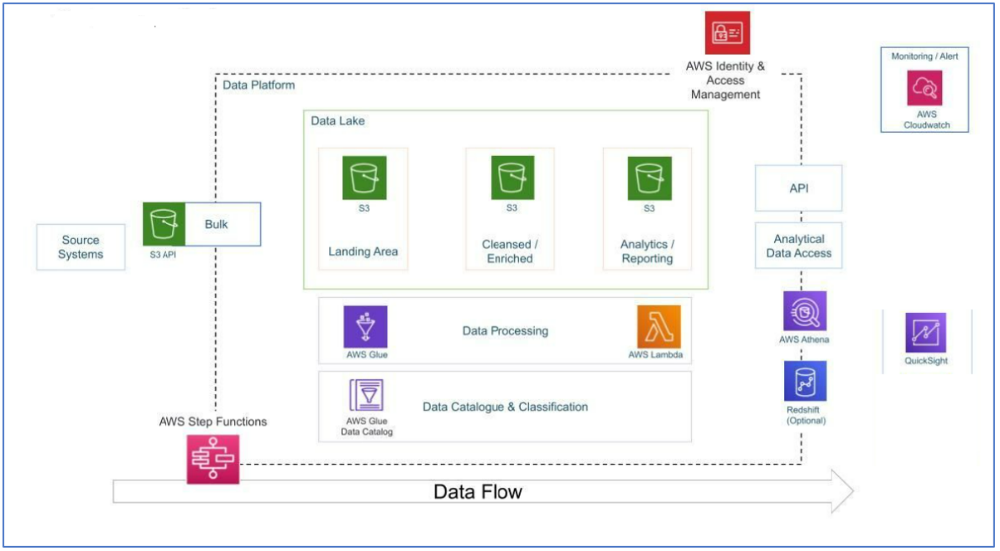

# -YouTube-Video-Data-Management-and-Analysis-using-AWS-Athena-and-AWS-Glue

# Table des matières

- [Objectif](#Objectif)
- [source de données](#source-de-données)
- [Architecture](#architecture)
- [services AWS](#services-AWS)
- [Ètapes du projets](#Ètapes-du-projets)
  - [I. Création d’un utilisateur IAM ](#I-Création-d'un-utilisateur-IAM) 
  - [II. Installation de AWS CLI ](#II.-Installation-de-AWS-CLI) 
  - [III. Extraction des données dans un compartiment S3](#III.extraction-des-donnees-dans-un-compartiment-S3)
  - [IV. Intégration des fichiers JSON avec AWS GLUE](#IV.-Intégration-des-fichiers-JSON-avec-AWS-GLUE)
  - [V. Analyse ad-hoc avec AWS Athena](#V.-Analyse-ad-hoc-avec-AWS-Athena)
  - [VI. nettoyage des données JSON avec AWS LAMBDA](#VI.-nettoyage-des-données-JSON-avec-AWS-LAMBDA)
  - [VII. Intégration des fichiers CSV avec AWS GLUE](#VII.-Intégration-des-fichiers-CSV-avec-AWS-GLUE)
  - [VIII. pré-traitement des données CSV avec AWS GLUE et AWS LAMBDA](#VIII.-pré-traitement-des-données-CSV-avec-AWS-GLUE-et-AWS-LAMBDA)
  - [IX. Créer un JOB ETL avec AWS GLUE](#IX.-Créer-un-JOB-ETL-avec-AWS-GLUE)

- [Conclusion](#conclusion)

# Objectif
Ce projet vise à gérer de manière sécurisée, rationaliser et analyser les données structurées et semi-structurées des vidéos YouTube en fonction des catégories de vidéos et des métriques de tendance.

Objectifs:

 - Ingestion des données : Mettre en place un mécanisme pour ingérer les données provenant de différentes sources.
- Processus ETL :   Recevoir les données au format brut et les transformer en un format approprié.
 - Lac de données : Centraliser les données provenant de multiples sources dans un dépôt centralisé.
- Scalabilité : Assurer que le système évolue avec l'augmentation du volume de données.
- Cloud : Utiliser le cloud pour traiter de grandes quantités de données, en l'occurrence AWS.
 - Reporting : Créer un tableau de bord pour répondre aux questions posées précédemment.

 # Source de données

 - Les données proviennent de Kaggle. Pour les trouver [cliquer ici.](https://www.kaggle.com/datasets/datasnaek/youtube-new)

Ces données Kaggle contiennent des statistiques (fichiers CSV) sur les vidéos YouTube populaires quotidiennes sur une période de plusieurs mois. Jusqu'à 200 vidéos tendance sont publiées chaque jour pour de nombreux emplacements. Les données pour chaque région sont dans leur propre fichier. Les éléments inclus dans les données sont le titre de la vidéo, le titre de la chaîne, l'heure de publication, les tags, les vues, les likes et dislikes, la description et le nombre de commentaires. Un champ category_id, qui varie selon la région, est également inclus dans le fichier JSON lié à la région.

# Architecture

# services AWS

 - Amazon S3 : Amazon S3 est un service de stockage d'objets qui offre une évolutivité massive, une disponibilité des données, une sécurité et des performances élevées.
 - AWS IAM : Il s'agit de la gestion des identités et des accès, qui permet de gérer l'accès aux services et ressources AWS de manière sécurisée.
 - Amazon QuickSight : Amazon QuickSight est un service de business intelligence (BI) scalable, sans serveur, intégré et alimenté par l'apprentissage automatique, conçu pour le cloud.
 - AWS Glue : Un service d'intégration de données sans serveur qui facilite la découverte, la préparation et la combinaison des données pour l'analyse, l'apprentissage automatique et le développement d'applications.
 - AWS Lambda : Lambda est un service de calcul qui permet aux programmeurs d'exécuter du code sans créer ni gérer de serveurs.
 - AWS Athena : Athena est un service de requêtes interactives pour S3, permettant de interroger les données directement dans S3 sans avoir besoin de les charger.

# Ètapes du projets

## I Création d’un utilisateur IAM 

Créer un utilisaeur IAM et lui  accorder la politique « Administrator Acces » puis lui créer une clé d'accès.

## II. Installation de AWS CLI
Téléchargez et exécutez le AWS CLI programme d'installation MSI pour Windows (64 bits) :
[https://awscli.amazonaws.com/AWSCLIV2.msi.](https://awscli.amazonaws.com/AWSCLIV2.msi)

## III. Extraction des données dans un compartiment S3
 - 1 Télécharger les données à partir de Kaggle
 - 2 Créer un compartiment S3
 - 3 Copier les données ( les fichier JSON et les fichier CSV) dans le compartiment S3 en utilisant AWS CLI

   
##  IV. Intégration des fichiers JSON avec AWS GLUE
- Créer un role pour AWS glue (Autoriser l’acces aux compartiments S3)
- Créer un crawler catalogue : Pour extraire des informations sur le schéma des données, ce qui est utile pour comprendre la structure des données, créer des transformations et générer des schémas de destination pour les data lakes. Une fois que les données sont découvertes et cataloguées par le crawler, elles peuvent être utilisées avec Amazon Athena pour l'analyse SQL
- Exécuter le crawler. Une table est créée dans la base de données destination ( crée lors de la création  du crawler catalogue) 
  
## V. Analyse ad-hoc avec AWS Athena
On va utiliser AWS Athena pour faire une analyse ad hoc : explorer rapidement les données et obtenir des réponses à des requêtes sans avoir à attendre le chargement préalable des données.
- Configurer un emplacement pour les résultats de requêtes dans Amazon S3.
- Exécuter la première requête. Résultat de la requête: Echek
- REMARQUE : Les fichiers JSON doivent être bien formés avec une structure cohérente pour être lus par AWS Athena. Chaque enregistrement JSON doit avoir le même schéma, ce qui signifie que les champs et les types de données doivent correspondre d'un enregistrement à l'autre. Si la structure JSON est inconsistante, cela entraîner des erreurs lors de la lecture des données.
- SOLUTION : Nettoyage des données en créant un ETL qui permet de transformer les fichiers JSON en fichier Apache Parquet

## VI. nettoyage des données JSON avec AWS LAMBDA
 - créer une fonction Lumbda qui permet de convertir un fichier JSON en un fichier Apache Parquet. Le processus de nettoyage est illustré dans le schéma suivant;
  
 - 1 créer un rôle pour la fonction Lambda (Autoriser l’acces aux compartiments S3)
 - 2 Créer un compartiment S3 qui va contenir les données nettoyées
 - 3 Créer la fonction lambda le code de la fonction est fourni dans [le fichier lambda_function.py.](Assets/Scripts/lambda_function.py)
 - 4 Tester la fonction. le code du test est fourni dans [le fichier test.txt.](Assets/Scripts/test.txt)
 - 5 Le package awswrangler n’est pas reconnu,  il faut ajouter la couche AWS « AWSSDKPandas-Python38 »
 - 6 Prolonger le temp d’expiration de la fonction Lambda à 10
 - 7 ajoute d’autre autorisation au rôle de la fonction Lambda ( Autorisation d'accès au service AWS Glue)
 - 8 vérifier les fichiers de type Parquet dans S3  et la table des donnése dans AWS glue
 - 9 Exécuter des requêtes dans AWS Athena
   
##  VII. Intégration des fichiers CSV avec AWS GLUE
- Créer un nouveau crawler pour créer un catalogue à partir des fichiers CSV du compartiment S3
- Exécuter le nouveau crawler. Une deuxième table est créée dans la base de données destination

## VIII. pré-traitement des données CSV avec AWS GLUE et AWS LAMBDA
- Changer le type de données dans le catalogue : changer le type de la colonne "category_id" de varchar à int
-	Supprimer le fichier Parquet dans le compartiment S3
-	Confirmer append dans la fonction Lambda
-	Exécuter le test dans la fonction Lambda
-	vérifier le schéma de la table et le type de la colonne id dans la console Athena

  
## IX.Créer un JOB ETL avec AWS GLUE
Charger tous les donneées cleanned dans un même compartiment en utilisant un job ETL
- Dans la console Glue, sélectionner Virtual ETL puis Créer un JOB ETL et l'exécuter.
- créer a glue crawler qui va créer une table dans la base de données 
- créer un trigger qui permet d’automatiser la fonction lamda

  Un résumé de ce qu’on a fait :

  
